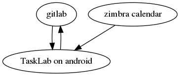

# tasklab

## Use cases

This small application makes your life easier in two situations:

- When you're browsing the web, Twitter, Arxiv... and you find something interesting that you quickly want to save for later
- When you want to manage your own personal TODO list, and you want it to be versioned, private, secure but still synchronized in the cloud.

It achieves the first use case by adding itself in the "share via..." menu of Android: whenever you find something interesting, you
may just click on share, then on this TaskLab icon, and your URL is automatically added as a new item in your current TODO list.

It achieves the second use case by synchronizing the local TODO list (that you may of course also edit via the main TaskLab application)
with any gitlab server.
I'm aware that developers commonly manage their TODO lists with issue trackers, but while issue trackers are perfect for team work,
they're an overkill for personal private TODO lists. And they are clearly too slow to deal with on a mobile: I rather want
a very fast app where adding and modifying a task is done in just one click.

Now, because git pull/push is not so easy to do in android, the idea here is to rather rely on a git(lab/hub) api for pulling  and commits.
Ultimately, a companion desktop app or web service should be done to get a similar service on your desktop, but this is less urgent
as you can always for now access this todo list with any git client, or on the gitlab web page.

Since recently, a third use case is supported: showing your next meetings fetched from your Zimbra calendar on your device.
Of course, it's possible to synchronize the Zimbra calendar with a local account on your android, but his often comes with restrictions,
and it's less simple to use as TaskLab; or you also may use a full-feature Zimbra android client, but it's really heavy and bloated when you
just want to know your future meetings.

## Usage

### Features

- This app is lightweight and should run on as old devices as gingerbread.
- It works offline: you may synchronize with the servers when you want and you're connected.
- It's not very nice-looking, but it's fast, and simple to use: just 4 buttons.
- Can be conveniently called from any "Share as" menu, to quickly add something to your personal reminder list

### Requirements

- You must have some gitlab account, with a repository named "TODO" with a text file named "todo.txt" in it.
- You may have a Zimbra account with your calendar

### How to use

- At first run, or later with button "SET-UP", you are asked to enter your gitlab credentials:
   - gitlab url, e.g. "https://gitlab.com"
   - gitlab username, e.g. "augustus"
   - gitlab password
- When you press "GET", it will download your TODO list from the gitlab server, erasing your local modifications, except for the just newly added item, if any, which is kept at the end of the list
- You can edit any line in your todo list by cliking once on it
- To add a new task, you just click on the bottom *New Task* line
- From outside the app, you can also add a new "task" by using the "share via" popup menu (for instance when you're browsing); in that case, simply choose the TaskLabApp in the share menu and the url will be added to your task list. This is a good option to store interesting references that you would like to access later on
- When you press "PUT", it will upload your TODO list to the gitlab server.
- Because of the way git works, it is very strongly recommended to always GET when adding any item, and always PUT just after editing 

For the Zimbra calendar:

- your must switch the default list by pressing the "Zimbra button": your local list of future meetings is shown.
- You cannot edit this list so far, but you can update it from the server by pressing the "GET" button.
- At the first run, it will ask for your Zimbra credentials:
   - zimbra url, e.g. "https://zimbra.inria.fr"
   - zimbra username, e.g. "augustus"
   - zimbra password

### Misc info

- The app synchronizes through the gitlab API; see [the gitlab doc](https://docs.gitlab.com/ce/api))
- Very simple build procedure: a simple "build.sh" script, which directly uses Ubuntu's android native packages: no other dependency, nothing fancy to install.

## Limitations

- No support for conflicts; but in a normal usage with frequent synchronizations, conflicts should not happen; if they still do, it is easy to solve them with git on a PC. In all cases, the "Get" button in the app will warn and just download the HEAD repository file.

